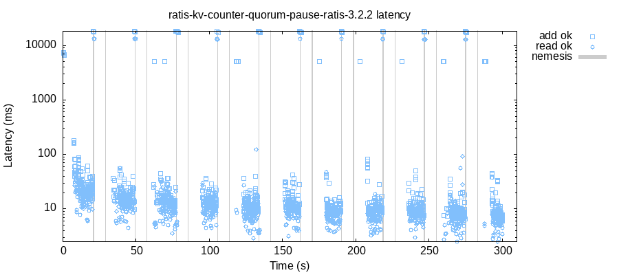

# Reference runs — Apache Ratis 3.2.2 — 2026-08-07

Twenty real harness runs against **Apache Ratis 3.2.2** (the release on
Maven Central), published so a reader can inspect what the harness
found without running anything. Two of the twenty are **expected-red**
runs — runs that exist to fail, proving the harness can convict — and
they are quarantined in their own table and directories
(`EXPECTED-RED-…`) so no skim of this page can mistake them for
harness failures. Everything else was expected green and **was green,
on the first and only attempt**: no run in this directory was repeated,
and none was discarded.

## What was tested

| | |
|---|---|
| System under test | `sut/ratis-kv` (this repository) at `0.1.0-SNAPSHOT`: a KV server embedding Ratis's `RaftServer`, driven through the real `RaftClient` |
| Ratis version | **3.2.2**, resolved from Maven Central; the harness JVM's own `ratis-client`/`-grpc`/`-metrics-default` matched to 3.2.2 at launch and recorded in every store (`:harness-ratis-client "3.2.2"`) |
| Harness commit | [`4126b48`](https://github.com/hooji/ratis-jepsen/commit/4126b48e1b2316b2c1c370ab352da64375f21aaa) (jepsen 0.3.13, knossos `cas-register` per key, JDK 21) |
| Topology | 5 voters `n1..n5` (7 nodes for the membership-bearing kinds — `n6`/`n7` join from the pool), one Docker container per node plus a control node, per [`env/`](../../env/) |
| CI runs (17 of 20) | GitHub Actions [run 31205755119](https://github.com/hooji/ratis-jepsen/actions/runs/31205755119), one fresh `ubuntu-latest` runner per scenario, dispatched 2026-08-07 ≈18:11 UTC; each row below links its job. The uploaded store artifacts there expire after 7 days — the selected artifacts here are permanent |
| Local runs (3 of 20) | this project's dev container (4-core x86_64 Linux, same Docker topology) — used only for the flags the CI workflow does not expose (`--reads`, the Q14 retry-cache levers) |
| lazyfs (durability runs) | commit `045a0b3a…` baked into the env image; every voter's storage dir becomes a proven FUSE mount on those runs |
| Date | all runs 2026-08-07 (UTC), stores named `20260807T…Z` |

Every run's `results.edn` here is byte-for-byte what the composed
checker wrote; nothing was regenerated after the fact.

## Green runs (expected green, and green)

`ok / fail / info` are op counts from the run's stats checker: `fail`
is dominated by designed CAS-precondition misses (register) — an
op the state machine legally rejected, not an error; `info` is an op
whose outcome is genuinely unknowable (in-flight through a fault),
which the checkers treat pessimistically. Wall is the harness's own
clock, node install/boot included; the op phase is capped at
`--time-limit 300` and the `none` / `torn-write` / `listener-probe`
runs end early because their op budget or script is finite.

| Scenario | Workload · faults | Wall | ok / fail / info | Evidence counted | Ran |
|---|---|---|---|---|---|
| [`none`](none/) | register · fault-free baseline | 42 s | 1093 / 407 / 0 | — | [CI](https://github.com/hooji/ratis-jepsen/actions/runs/31205755119/job/92956464735) |
| [`partition`](partition/) | register · random-halves partition, 15 s on/off | 309 s | 1096 / 404 / 0 | — | [CI](https://github.com/hooji/ratis-jepsen/actions/runs/31205755119/job/92956464785) |
| [`crash`](crash/) | register · `kill -9` 1–2 of 5, leader-biased, restart | 311 s | 1108 / 392 / 0 | — | [CI](https://github.com/hooji/ratis-jepsen/actions/runs/31205755119/job/92956464656) |
| [`pause`](pause/) | register · SIGSTOP/SIGCONT 1–2 of 5 | 310 s | 1125 / 375 / 0 | — | [CI](https://github.com/hooji/ratis-jepsen/actions/runs/31205755119/job/92956464812) |
| [`mixed`](mixed/) | register · 10 segments drawn from the M1 three (this run: 4 crash / 2 pause / 4 partition) | 310 s | 1076 / 414 / 10 | — | [CI](https://github.com/hooji/ratis-jepsen/actions/runs/31205755119/job/92956464696) |
| [`mixed-all`](mixed-all/) | register · segments from six kinds (this run: 2 crash / 3 pause / 3 partition / 1 churn / 1 transfer) | 322 s | 1090 / 410 / 0 | — | [CI](https://github.com/hooji/ratis-jepsen/actions/runs/31205755119/job/92956464688) |
| [`transfer`](transfer/) | register · repeated leadership transfer | 312 s | 1086 / 414 / 0 | — | [CI](https://github.com/hooji/ratis-jepsen/actions/runs/31205755119/job/92956464807) |
| [`snapshot-churn`](snapshot-churn/) | register · follower held back → transfer → snapshot+purge → restart | 308 s | 1076 / 424 / 0 | **2 install-snapshot events** (`n5` send → `n3` receive) | [CI](https://github.com/hooji/ratis-jepsen/actions/runs/31205755119/job/92956464813) |
| [`membership`](membership/) | register · add/remove/replace voters over the 7-node pool | 319 s | 1078 / 422 / 0 | **21 committed conf transitions**, 7 distinct nodes through joins | [CI](https://github.com/hooji/ratis-jepsen/actions/runs/31205755119/job/92956464762) |
| [`membership-snapshot-churn`](membership-snapshot-churn/) | register · membership + churn interleaved (rate 1.4, 800 ops/key) | 312 s | 1497 / 594 / 0 | 8 conf transitions; **3 joiners, all 3 installed a snapshot to join**; 10 install log events | [CI](https://github.com/hooji/ratis-jepsen/actions/runs/31205755119/job/92956464711) |
| [`listener-probe`](listener-probe/) | register · scripted LISTENER stage → promote → demote → remove | 72 s | 1118 / 382 / 0 | 4 committed conf transitions; the staged listener's read refusals recorded (see below) | [CI](https://github.com/hooji/ratis-jepsen/actions/runs/31205755119/job/92956464705) |
| [`counter-crash`](counter-crash/) | **counter** · leader-biased kill cycles | 309 s | 2045 / 0 / 31 | exactly-once held on all 5 keys; **217 client retries** across 80 ops (193 add / 24 read) | [CI](https://github.com/hooji/ratis-jepsen/actions/runs/31205755119/job/92956464706) |
| [`unsync-drop`](unsync-drop/) | register · `kill -9` a minority + **drop un-fsynced page cache** (lazyfs), restart | 313 s | 1123 / 377 / 0 | mounts proven ×5; **15 clear-cache acks** | [CI](https://github.com/hooji/ratis-jepsen/actions/runs/31205755119/job/92956464728) |
| [`unsync-drop-all`](unsync-drop-all/) | register · the same power loss on **every voter at once** | 314 s | 1009 / 433 / 101 | **20 clear-cache acks** = 4 cycles × 5 nodes | [CI](https://github.com/hooji/ratis-jepsen/actions/runs/31205755119/job/92956464820) |
| [`counter-unsync-drop`](counter-unsync-drop/) | **counter** · minority power loss (lazyfs) | 313 s | 2075 / 2 / 19 | 14 clear-cache acks; 141 retries across 51 ops; exactly-once held | [CI](https://github.com/hooji/ratis-jepsen/actions/runs/31205755119/job/92956464757) |
| [`torn-write`](torn-write/) | register · tear one follower's log append mid-write (lazyfs torn-op) | 54 s | 1068 / 432 / 0 | tear **armed and fired** on `n5` (14 of ~48 bytes persisted); victim **refused to restart, loudly**; majority served the full budget | [CI](https://github.com/hooji/ratis-jepsen/actions/runs/31205755119/job/92956464818) |
| [`partition-reads-mixed`](partition-reads-mixed/) | register · partition, linearizable reads **targeted at followers 50/50** (`--reads mixed`) | 318 s | 1021 / 479 / 0 | 156 of 414 `:ok` reads follower-served (`:read-via` n4 61 · n3 55 · n2 21 · n1 19) | local |
| [`counter-quorum-pause-default-window`](counter-quorum-pause-default-window/) | **counter** · quorum stall (SIGSTOP all followers), retry delay 5 s, **retry cache left at its default 60 s** — the control run for Q14 below | 313 s | 1893 / 0 / 0 | **308 client retries, every one deduplicated**: zero violations on all 5 keys | local |

Every row: `:valid? true` from every composed checker —
per-key linearizability (register) or counter bounds, **liveness**
(nemesis windows gated out), stats, unhandled exceptions, and the
evidence checkers. On rows whose faults leave server-side traces, the
evidence assertions **counted real events** (quoted below) — none of
these greens is a run whose fault path silently failed to happen.

## Expected-red runs — these two FAIL on purpose ✅

> **Reading this table:** "RED" below is the *pass* condition. These
> runs exist to prove the harness convicts when the system lies. A
> green outcome here would have been reported as a harness defect.

| Run | What is planted | Verdict | Expected | Ran |
|---|---|---|---|---|
| [`EXPECTED-RED-seeded-stale-reads`](EXPECTED-RED-seeded-stale-reads/) | every node started with `--seed-bug stale-reads` (linearizable reads served from a ~500 ms-lagging copy) | **RED as expected** — exit 1, `:valid? false`, convicted on **all five keys** (129 s, 1096/389/15) | RED | [CI red-gate](https://github.com/hooji/ratis-jepsen/actions/runs/31205755119/job/92956464339) |
| [`EXPECTED-RED-q14-retry-cache-expiry`](EXPECTED-RED-q14-retry-cache-expiry/) | server retry cache shrunk to **500 ms** under a client retrying at 5 s spacing (violating the flag's own contract, on purpose), under `quorum-pause` | **RED as expected** — exit 1, `:double-count` on **all five keys** (320 s, 1906/0/0) | RED | local |

### The seeded-bug red gate (the "test of the test")

The CI sweep re-runs this gate on every dispatch: a 120 s partition run
whose SUT lies about reads. The knossos checker convicted all five
keys; key 0's final path ends with a read the register cannot serve —
process 20 legally read `1`, then read `3` while the register still
held `1`:

```
{:process 20, :type :ok, :f :read, :value 1, :index 297}   ; model {:value 1}
{:process 20, :type :ok, :f :read, :value 3, :index 307}   ; "can't read 3 from register 1"
```

The planted bug's banner appears in every node's committed log
(`n*-ratis-kv.log.gz` here, e.g. `n1` line 2: `*** SEEDED BUG ACTIVE:
stale-reads ***`), and knossos drew the conviction for each key —
key 0's diagram (illegal transition in red):


### Q14 — the retry-cache expiry boundary, re-armed deliberately

Command (the two flags marked ⚠ violate the retry-cache contract on
purpose — that is the experiment):

```
env/run.sh test --workload counter --nemesis quorum-pause \
  --retry-cache-expiry-ms 500 ⚠  --retry-delay-ms 5000 ⚠ \
  --rate 3 --ops-per-key 1200 --time-limit 300
```

`quorum-pause` SIGSTOPs every follower and leaves the leader alive: it
keeps **appending** client adds but cannot commit them, so each add in
a stall window times out client-side, commits at resume, and its
same-callId retry arrives 5 s later — after the 500 ms cache entry
expired — and is **appended and applied again**. The run's latency
chart is the whole mechanism in one picture: ~10 ms adds between
stalls, 10–20 s acknowledged completions inside each grey nemesis band:



The counter checker convicted **every key**, first violations:

```
key 0  {:kind :double-count, :read {:value 118}, :lower 116, :upper 116}
key 1  {:kind :double-count, :read {:value 113}, :lower 110, :upper 110}
key 2  {:kind :double-count, :read {:value 116}, :lower 112, :upper 112}
key 3  {:kind :double-count, :read {:value 129}, :lower 127, :upper 127}
key 4  {:kind :double-count, :read {:value 115}, :lower 108, :upper 113}
```

— linearizable reads of values **strictly above** the exactly-once
bounds. The run has **zero `:info` ops** (1906 of 1906 acknowledged
clean, 305 client retries over 127 ops recorded), so there is no
0-or-1 ambiguity slack: every excess unit is a proven double-apply
that the cluster acknowledged as a clean success.

**The control run** (`counter-quorum-pause`, green table above): the
identical fault and retry shape with the retry cache left at its
default 60 s **passes** — the red is caused by the shrunken window,
not by the fault. Together with `counter-crash` (default window under
leader kills: exactly-once held through 217 retries) this brackets the
documented hazard: it is **timeout-shaped, not crash-shaped**, and it
sits exactly where Ratis's own flag contract says it sits.

## What the green runs proved (with the evidence quoted)

**Register linearizability + liveness under process and network
faults** (`none`, `partition`, `crash`, `pause`, `mixed`, `mixed-all`,
`transfer`): every per-key knossos analysis valid; the liveness checker
(which fails a healthy-majority cluster that stops acknowledging)
valid with zero violations; zero unhandled client exceptions. The
`:info` counts stayed small (0–10 on these runs) and only on
fault-window writes.

**Snapshot install is real, not assumed** (`snapshot-churn`): the
evidence checker requires leader-send/receiver-receive pairs in the
node logs, and counted 2 (one event). From
[`snapshot-churn/node-log-excerpts.txt`](snapshot-churn/node-log-excerpts.txt),
verbatim:

```
n5/ratis-kv.log:1105: … GrpcLogAppender - n5@…->n3-GrpcLogAppender: followerNextIndex = 910
                      but logStartIndex = 1056, send snapshot SingleFileSnapshotInfo(t:2, i:1361) … to follower
n3/ratis-kv.log:231:  … SnapshotInstallationHandler - n3@…: receive installSnapshot: n5->n3#0-t2,chunk:…
```

A run of this scenario that produces zero installs **fails** — that
negative arm was demonstrated when the checker was built (see
`docs/RUNS.md`, 2026-08-05, first-attempt artifact 1).

**Configuration changes actually commit** (`membership`): 21 distinct
transitional entries (`old=peers:` lines — the filter that keeps
elections from masquerading as conf changes) committed while voters
were added, removed and replaced; 7 distinct nodes cycled through
joins. From [`membership/node-log-excerpts.txt`](membership/node-log-excerpts.txt):

```
n1/ratis-kv.log:… set configuration conf: {index: …, cur=peers:[…]|listeners:[],
                 old=peers:[…, n5|n5:6000]|listeners:[]}
```

**Fresh joiners install snapshots to join**
(`membership-snapshot-churn`): all three post-snapshot joiners
(`n4`, `n1`, `n7`) came in via install during staging
(`:joined-with-installs ["n4" "n1" "n7"]` in `results.edn`), against a
leader whose log head was purged — the only way in. The joiners served
afterwards; this runs on the Job 08 SUT lifecycle fix, and the same
scenario **convicted** the pre-fix SUT when it was first built (ledger,
2026-08-05).

**The staged-listener wedge is still visible** (`listener-probe`):
every conf mechanic passed — stage `n7` as LISTENER, promote to voter,
demote, remove, all committed (4 transitions) — while a linearizable
read targeted at `n7` was refused with `ServerNotReadyException: … is
not in [RUNNING]: current state is STARTING`, both as listener and
after promotion ([`listener-probe/probe-ops.txt`](listener-probe/probe-ops.txt),
ops 2 and 4). That is BACKLOG item 9 (the RATIS-1825 corroboration),
reproduced here on a fresh CI runner. The run is *green* because the
probe records rather than asserts — the finding's classification lives
in [`docs/BACKLOG.md`](../../docs/BACKLOG.md).

**Exactly-once under retries** (`counter-crash`,
`counter-unsync-drop`): the counter workload's non-idempotent ADDs were
demonstrably retried by the client (retry evidence: 217 and 141
retries; the checker fails a counter run with zero retries) and every
`:ok` add counted exactly once against per-key bounds pinned at every
apply, with `violations []` on all five keys of both runs.

**Acknowledged writes survive losing un-fsynced state** (`unsync-drop`,
`unsync-drop-all`, `counter-unsync-drop`): each node's storage was a
lazyfs FUSE mount **proven at setup** (mount table + fault fifo + a
fsync'd canary observed in the backing dir — a run that cannot prove
its mounts aborts); each cycle `kill -9`s the victims and commands
lazyfs to drop their un-synced page cache before restart, and the
per-node lazyfs logs acknowledge every drop
(`node-log-excerpts.txt`: `received 'lazyfs::clear-cache'` /
`cache is cleared.` — 15, 20 and 14 acks). Linearizability, liveness
and (on the counter run) exactly-once all held: **no acknowledged
write was lost**. The whole-cluster run's 101 `:info` ops are the
honest ambiguity of writes in flight during total outage — the
checkers treat each as 0-or-1, and the analysis (4.8 s) stayed sound.

**A torn log append is refused, not silently absorbed** (`torn-write`):
lazyfs tore `n5`'s in-progress log append (`will persist 14 bytes from
offset 54443`, then killed itself, dropping its cache). On restart over
the torn store, Ratis 3.2.2 at its default `CorruptionPolicy=EXCEPTION`
refused to start:

```
Caused by: org.apache.ratis.protocol.exceptions.ChecksumException:
  Log entry corrupted: Calculated checksum is 70ACB010 but read checksum is 00000000.
… Failed to initRaftLog → division refused start (n5-ratis-kv.log.gz, full trace)
```

The remaining 4/5 majority served the entire op budget linearizably.
Loud refusal, no wrong data, no lost acknowledged write. (The run ends
at 54 s because the tear script and op budget are finite.)

**Follower-served linearizable reads stay linearizable**
(`partition-reads-mixed`, local): 50/50 of linearizable reads sent via
`sendReadOnly(msg, peerId)` at a non-leader — 156 of the run's 414
`:ok` reads follower-served, spread `n4:61 n3:55 n2:21 n1:19` (`n5`
held the lead) — under the cycling partition, all checkers valid.

## Known limits of these runs

- **Scale**: each run is a single ~300 s window, ~1500 register ops or
  ~1900–2100 counter ops, 5 keys, per-key budgets sized to knossos
  (the ledger's designed budget). These runs find correctness bugs in
  the tested paths; they are not soak tests and cannot see rare races
  that need hours or larger histories.
- **One run per scenario, this date**: repetition statistics live in
  the project ledger ([`docs/RUNS.md`](../../docs/RUNS.md)), which
  records the same scenarios green across multiple prior dates and the
  historically flaky shapes run ×2–×3 there.
- **Blind spots** (inherited from the harness, documented across
  `docs/`): single Raft group; gRPC without TLS; no DataStream API; no
  performance claims; lazyfs models lost un-synced writes and torn
  writes but **not** rename durability (BACKLOG 10 stays out of
  reach); the elle checker migration is deferred, knossos caps the
  op budget; register `:fail` counts are dominated by designed CAS
  precondition misses.
- **Environment**: CI rows ran on shared GitHub-hosted runners —
  wall-clock and analysis timings vary by machine (the ledger notes
  ~2× variance); verdicts and evidence counts are machine-independent.

## Anomalies

- **None in the verdicts**: every expected-green run was green and both
  expected-red runs were red, all on their only attempt. Nothing was
  re-run, nothing was discarded.
- The local stores carry `latency-raw.png` / `latency-quantiles.png` /
  `rate.png` because gnuplot was installed into the local control
  container for this publication job; the env image does not ship
  gnuplot, so the CI stores have no plots. Run behavior is unaffected
  (jepsen draws plots after the fact, from the same history that is
  committed here).
- `n5` received zero follower-targeted reads in `partition-reads-mixed`
  — it held leadership throughout, and targets are drawn from
  non-leaders; not a routing defect.

## What was committed here, and what was left out

Kept per run (this whole directory: **3.7 MB** committed, ~120 files —
the 20 runs' uncompressed stores total ≈55 MB): `results.edn`
(complete checker output), `jepsen.log.gz` (full harness log),
`history.txt.gz` + `history.edn.gz` (the complete op history — the raw
evidence), `node-log-excerpts.txt` where a run's proof lives in server
logs (with node/file/line provenance), **full** per-node
`ratis-kv.log.gz` (+ `lazyfs.log.gz`) for the two expected-red runs and
`torn-write`, knossos `linear-key*.svg` for the convicted keys, and the
latency/rate charts where drawn (local runs; see Anomalies).

Dropped, deliberately: `test.jepsen` (jepsen's binary serialized test
map — unreadable without the harness), per-key interactive
`timeline.html` files, full node logs on ordinary green runs (the
excerpts above carry the evidence lines; the full logs remain in the
CI artifacts for 7 days and any run is reproducible from the pinned
commit), and jepsen's `latest`/`current` store symlinks.
