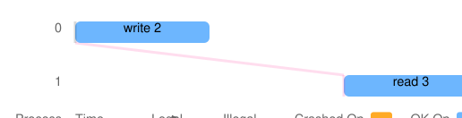

# Reference runs — Apache Ratis 3.3.0 **RC2** (release candidate) — 2026-08-07

Twenty-one reference runs against the **Apache Ratis 3.3.0 release
candidate 2** artifacts (plus two runs voided by a tooling collision,
preserved and analyzed in
[`VOIDED-collided-runs/`](VOIDED-collided-runs/README.md) — read that
before treating any follower-reads number here as the run's second
attempt: it is the incident record, not a retry-for-green). **3.3.0 RC2 is not a released version**: as of
2026-08-07 it is absent from Maven Central and
`downloads.apache.org/ratis`, and exists as the candidate under vote.
Every result in this directory describes those candidate bits — exactly
what will ship *if* the vote passes, but the release could still change
or be abandoned. No number here should be quoted as "Ratis 3.3.0"
without the RC2 qualifier.

One of the twenty-one runs is an **expected-red** run (it exists to
fail, proving the harness still convicts at this version); it is
quarantined in its own table and an `EXPECTED-RED-…` directory. All
twenty CI runs were green (or expectedly red) **on the first and only
attempt**; the one local scenario was re-run once after the collision
incident above, with both voided outcomes published. Three runs span
*both* versions (3.2.2 → RC2); they live under
[`mixed-version-3.2.2-and-rc2/`](mixed-version-3.2.2-and-rc2/) and are
labelled as such wherever they appear.

## What was tested — and where these "3.3.0" bits come from

| | |
|---|---|
| Ratis artifacts | version string `3.3.0` resolved from the **Apache staging repository** `repository.apache.org/content/repositories/orgapacheratis-1182/` (the RC2 under vote). Provenance was verified by Job 12 (2026-08-07): the staging `ratis-server-3.3.0.jar` is byte-identical (sha512) to the jar inside the sha512-verified `apache-ratis-3.3.0-bin.tar.gz` under `dist.apache.org/repos/dist/dev/ratis/3.3.0/rc2/`. The staging URL is a run-time input — nothing in the repository hardcodes it — because staging repos are dropped after promotion |
| System under test | `sut/ratis-kv` `0.1.0-SNAPSHOT` (this repository), **identical source** to the 3.2.2 directory's runs — only the Ratis dependency differs; the harness JVM's own `ratis-client` matched to the version under test (mixed runs run the **old** 3.2.2 client — clients upgrade last) |
| Harness commit | [`4126b48`](https://github.com/hooji/ratis-jepsen/commit/4126b48e1b2316b2c1c370ab352da64375f21aaa) (jepsen 0.3.13, knossos `cas-register`, JDK 21) |
| Topology | 5 voters `n1..n5` (7 nodes for membership-bearing kinds), Docker per [`env/`](../../env/); mixed-version runs install **both** versions on every node and flip a per-node symlink |
| CI runs (20 of 21) | GitHub Actions [run 31205774470](https://github.com/hooji/ratis-jepsen/actions/runs/31205774470), one fresh `ubuntu-latest` runner per scenario, dispatched 2026-08-07 with `ratis-version=3.3.0`, `mixed-version=3.2.2,3.3.0`, `ratis-repo-url=<staging 1182>`. CI store artifacts expire in 7 days; the selection here is permanent |
| Local runs (1 of 21) | the dev container (4-core x86_64), used only for `--reads mixed` (a flag CI does not expose) |
| Date | all runs 2026-08-07 (UTC) |

## Green runs (expected green, and green)

Column meanings as in the [3.2.2 README](../2026-08-07-ratis-3.2.2/README.md):
`fail` is dominated by designed CAS-precondition misses; `info` is
honest ambiguity through a fault window; wall includes node
install/boot; op phase capped at 300 s.

| Scenario | Workload · faults | Wall | ok / fail / info | Evidence counted | Ran |
|---|---|---|---|---|---|
| [`none`](none/) | register · fault-free baseline | 39 s | 1088 / 412 / 0 | — | [CI](https://github.com/hooji/ratis-jepsen/actions/runs/31205774470/job/92958716838) |
| [`partition`](partition/) | register · random-halves partition | 309 s | 1121 / 377 / 2 | — | [CI](https://github.com/hooji/ratis-jepsen/actions/runs/31205774470/job/92958716921) |
| [`crash`](crash/) | register · leader-biased `kill -9`, restart | 311 s | 1082 / 410 / 8 | — | [CI](https://github.com/hooji/ratis-jepsen/actions/runs/31205774470/job/92958716808) |
| [`pause`](pause/) | register · SIGSTOP/SIGCONT | 309 s | 1101 / 399 / 0 | — | [CI](https://github.com/hooji/ratis-jepsen/actions/runs/31205774470/job/92958716931) |
| [`mixed`](mixed/) | register · 10 segments (this run: 3 crash / 2 pause / 5 partition) | 310 s | 1101 / 397 / 2 | — | [CI](https://github.com/hooji/ratis-jepsen/actions/runs/31205774470/job/92958716864) |
| [`mixed-all`](mixed-all/) | register · 11 segments from six kinds (3 crash / 2 pause / 1 partition / 2 churn / 3 transfer) | 323 s | 1080 / 420 / 0 | — | [CI](https://github.com/hooji/ratis-jepsen/actions/runs/31205774470/job/92958716899) |
| [`transfer`](transfer/) | register · repeated leadership transfer | 312 s | 1061 / 439 / 0 | — | [CI](https://github.com/hooji/ratis-jepsen/actions/runs/31205774470/job/92958716927) |
| [`snapshot-churn`](snapshot-churn/) | register · forced install-snapshot path | 313 s | 1113 / 387 / 0 | **2 install-snapshot events** (`n2` send → `n5` receive); receiver kept serving | [CI](https://github.com/hooji/ratis-jepsen/actions/runs/31205774470/job/92958716859) |
| [`membership`](membership/) | register · voter add/remove/replace over the pool | 319 s | 1067 / 433 / 0 | **21 committed conf transitions** | [CI](https://github.com/hooji/ratis-jepsen/actions/runs/31205774470/job/92958716873) |
| [`membership-snapshot-churn`](membership-snapshot-churn/) | register · membership + churn (rate 1.4, 800 ops/key) | 316 s | 1531 / 531 / 5 | 8 conf transitions; 4 joins — the 2 post-snapshot joiners (`n4`, `n5`) **both installed to join**, the 2 pre-snapshot joins correctly needed none | [CI](https://github.com/hooji/ratis-jepsen/actions/runs/31205774470/job/92958716837) |
| [`listener-probe`](listener-probe/) | register · LISTENER stage → promote → demote → remove | 73 s | 1074 / 426 / 0 | 4 committed transitions; **the staged-listener wedge persists at RC2** (below) | [CI](https://github.com/hooji/ratis-jepsen/actions/runs/31205774470/job/92958716812) |
| [`counter-crash`](counter-crash/) | **counter** · leader-biased kill cycles | 311 s | 2061 / 3 / 35 | exactly-once on all 5 keys; **243 retries** across 94 ops (202 add / 41 read) | [CI](https://github.com/hooji/ratis-jepsen/actions/runs/31205774470/job/92958716795) |
| [`unsync-drop`](unsync-drop/) | register · minority power-loss (lazyfs cache drop) | 313 s | 1106 / 394 / 0 | mounts proven ×5; **16 clear-cache acks** | [CI](https://github.com/hooji/ratis-jepsen/actions/runs/31205774470/job/92958716903) |
| [`unsync-drop-all`](unsync-drop-all/) | register · power loss on **every voter at once** | 318 s | 987 / 407 / 105 | **20 acks** = 4 cycles × 5 nodes | [CI](https://github.com/hooji/ratis-jepsen/actions/runs/31205774470/job/92958716875) |
| [`counter-unsync-drop`](counter-unsync-drop/) | **counter** · minority power loss | 313 s | 2047 / 3 / 25 | 16 acks; 155 retries; exactly-once held | [CI](https://github.com/hooji/ratis-jepsen/actions/runs/31205774470/job/92958716966) |
| [`torn-write`](torn-write/) | register · torn log append (lazyfs) | 53 s | 1078 / 422 / 0 | tear fired on `n3` (14 bytes of the batch persisted); **refused restart loudly**; majority served the full budget | [CI](https://github.com/hooji/ratis-jepsen/actions/runs/31205774470/job/92958716850) |
| [`partition-reads-mixed`](partition-reads-mixed/) | register · partition, linearizable reads **targeted at followers 50/50** (`--reads mixed`) | 317 s | 1055 / 445 / 0 | 183 of 426 `:ok` reads follower-served (`:read-via` n5 77 · n4 50 · n3 29 · n1 27) | local — the clean re-run after the [voided collision](VOIDED-collided-runs/README.md) |

**Mixed-version runs** — each spans **both** versions (3.2.2 **and**
3.3.0 RC2 in one cluster; harness client on the old 3.2.2, because
clients upgrade last):

| Scenario | Topology | Wall | ok / fail / info | Evidence counted | Ran |
|---|---|---|---|---|---|
| [`static-split-partition`](mixed-version-3.2.2-and-rc2/static-split-partition/) | `n1`–`n3` at 3.2.2, `n4`–`n5` at RC2, partition cycling | 311 s | 1150 / 350 / 0 | version map recorded in-store | [CI](https://github.com/hooji/ratis-jepsen/actions/runs/31205774470/job/92958716848) |
| [`static-split-crash`](mixed-version-3.2.2-and-rc2/static-split-crash/) | same split, leader-biased kills | 313 s | 1117 / 372 / 11 | — | [CI](https://github.com/hooji/ratis-jepsen/actions/runs/31205774470/job/92958716896) |
| [`rolling-upgrade`](mixed-version-3.2.2-and-rc2/rolling-upgrade/) | start all-3.2.2, roll `n1`…`n5` to RC2 one at a time **under load** | 173 s | 1063 / 437 / 0 | **5/5 rolls applied, none failed, zero skips**; every RC2 node opened its predecessor's 3.2.2-written storage in place | [CI](https://github.com/hooji/ratis-jepsen/actions/runs/31205774470/job/92958716886) |

Every green row: `:valid? true` from every composed checker
(linearizability / counter bounds, liveness, stats, exceptions, and the
evidence checkers). **No behavioral difference from 3.2.2 surfaced in
any of these runs** — same verdicts, same evidence shapes, op counts in
the same bands.

## The expected-red run — this one FAILS on purpose ✅

> "RED" is the *pass* condition here: the run proves the harness still
> catches a lying SUT when it runs against the RC2 artifacts.

| Run | What is planted | Verdict | Expected | Ran |
|---|---|---|---|---|
| [`EXPECTED-RED-seeded-stale-reads`](EXPECTED-RED-seeded-stale-reads/) | every node started with `--seed-bug stale-reads` (~500 ms-lagging read copy), partition nemesis, 120 s | **RED as expected** — exit 1, `:valid? false`, convicted on **all five keys** (129 s, 1104/395/1) | RED | [CI red-gate](https://github.com/hooji/ratis-jepsen/actions/runs/31205774470/job/92958716604) |

Key 0's conviction, verbatim from `results.edn` — process 0's write of
`2` committed, then process 1 read the stale `3`:

```
{:process 0, :type :ok, :f :write, :value 2, :index 80}   ; model {:value 2}
{:process 1, :type :ok, :f :read,  :value 3, :index 89}   ; "can't read 3 from register 2"
```



(The Q14 retry-cache-expiry expected-red was **not** repeated at RC2 —
it is a harness-calibration demonstration, performed and published in
the [3.2.2 directory](../2026-08-07-ratis-3.2.2/README.md); re-arming
it against RC2 would be new exploration, out of this publication's
scope. Deliberate skip, stated here so nobody reads absence as
significance.)

## What the runs proved at RC2, beyond "still green"

**The install path works and the receiver survives** — the
`snapshot-churn` evidence pair, verbatim from
[`node-log-excerpts.txt`](snapshot-churn/node-log-excerpts.txt):

```
n2/ratis-kv.log: … GrpcLogAppender - n2@…->n5-GrpcLogAppender: followerNextIndex = 887
                 but logStartIndex = 1043, send snapshot … to follower
n5/ratis-kv.log: … SnapshotInstallationHandler - n5@…: receive installSnapshot: n2->n5#0-t…
```

Note the scope of this green: our SUT manages the state-machine
lifecycle itself. The **library-level** finding that a naive
`BaseStateMachine` integrator's division dies on live install (BACKLOG
item 7) was separately re-probed at RC2 by Job 12 and **persists** —
these runs neither test nor contradict that.

**Rolling upgrade under load** — the run's
[`roll-ops.txt`](mixed-version-3.2.2-and-rc2/rolling-upgrade/roll-ops.txt)
records each roll (`kill → symlink flip → restart → startup line
awaited`) with the cluster's version map at every step:

```
:roll {:node "n1", :from "3.2.2", :to "3.3.0", :await :started, :active "3.3.0",
       :versions-now {"n1" "3.3.0", "n2" "3.2.2", "n3" "3.2.2", "n4" "3.2.2", "n5" "3.2.2"}}
```

…walking to all-RC2 while linearizability and liveness held through
every intermediate mix, with the run's tail a 3.2.2 client against an
all-RC2 cluster. (The 173 s wall is benign: rolls take seconds, no
fault windows stretch latencies, so the 1500-op budget exhausts early —
same shape as the ledger's Job 12 run.)

**The staged-listener wedge (BACKLOG 9) persists at RC2** — from
[`listener-probe/probe-ops.txt`](listener-probe/probe-ops.txt): staging
`n7` as LISTENER committed, replication to it confirmed, promotion to
voter committed, demotion and removal committed — while the targeted
linearizable read failed both times with

```
ServerNotReadyException: n7@group-… is not in [RUNNING]: current state is STARTING
```

The run is green because the probe records rather than asserts; the
finding and its mechanism (a FOLLOWER-role-only caught-up mark in
`checkStaging`, source-identical at RC2) are classified in
[`docs/BACKLOG.md`](../../docs/BACKLOG.md).

**Torn write refused at RC2 too** (`torn-write`): lazyfs persisted 14
bytes of `n3`'s in-flight log append then dropped the rest
(`will persist 14 bytes from offset 54258`); on restart Ratis refused:

```
ChecksumException: Log entry corrupted: Calculated checksum is 3C71E2ED but read checksum is 00000000.
```

(`n3-ratis-kv.log.gz` has the full trace; outcome recorded as
`{:victim "n3", :outcome :refused-start, :fired true}` in
`results.edn`.) Majority served throughout; no silent wrong data.

**Exactly-once and durability behave as at 3.2.2**: counter bounds
held under leader kills (243 retries) and under power-loss drops (155
retries, 16 acks); all acknowledged writes survived minority and
whole-cluster un-synced-cache loss (16 / 20 acks, mounts proven ×5
per run).

**Follower-served linearizable reads at RC2**
(`partition-reads-mixed`, local — run alone on a quiesced topology
after the voided collision): 183 of the run's 426 `:ok` linearizable
reads were served via `sendReadOnly(msg, peerId)` at an explicit
non-leader target (`n5:77 n4:50 n3:29 n1:27`; `n2` held leadership)
under the cycling partition, with zero `:info` ops and every checker
valid — the same shape as the 3.2.2 run.

## Known limits of these runs

Everything in the [3.2.2 README's Known limits](../2026-08-07-ratis-3.2.2/README.md#known-limits-of-these-runs)
applies unchanged (300 s single-window runs, knossos budgets, one run
per scenario on this date, the harness's documented blind spots,
CI-runner timing variance). Additionally, RC2-specific:

- **These are candidate bits.** If the RC2 vote fails, this directory
  documents an artifact set that never shipped. If it passes, the
  promoted 3.3.0 jars should be byte-identical — but verify against
  Central rather than assuming.
- **Library-level probes are not in this directory.** The BACKLOG 7/8/9
  re-probes at RC2 (base-class `pause()` trap persists; `GroupInfoReply`
  conf fix confirmed; listener wedge persists) were Job 12's in-JVM
  probes, recorded in `docs/RUNS.md` — only BACKLOG 9's cluster-level
  probe repeats here.
- **Mixed-version coverage is the three shapes above.** Static splits
  under pause/transfer and a mixed `--workload counter` run are
  supported by the harness but were not part of the established gate
  set and were deliberately not run here.

## Anomalies

- **The one incident of the whole publication batch happened in this
  directory's local scenario**: the worker's tooling accidentally ran
  `partition --reads mixed` **twice concurrently** against the same
  cluster. Both runs were voided on the collision facts (before
  looking at verdicts), both outcomes are published with a timeline in
  [`VOIDED-collided-runs/`](VOIDED-collided-runs/README.md), and the
  scenario was re-run once, alone — that clean run is the table row.
  No other run in either version directory was repeated or discarded.
- **None in the verdicts otherwise**: 20 of 20 CI runs matched
  expectation on the only attempt (19 green, 1 expected-red red).
- As in the 3.2.2 directory: CI stores carry no latency/rate PNGs (no
  gnuplot in the env image); the local store does.

## What was committed here, and what was left out

Same selection policy as the 3.2.2 directory: kept `results.edn`,
`jepsen.log.gz`, both history files (gz), evidence excerpts with
provenance, full node logs for the expected-red and torn-write runs,
conviction SVGs, and local-run charts; dropped `test.jepsen`, per-key
`timeline.html`, full node logs on ordinary green runs (excerpts
committed; CI artifacts hold the rest for 7 days), and store symlinks.
This whole directory: **≈3 MB** committed (the 21 reference runs' + 2
voided runs' uncompressed stores total ≈60 MB); exact totals in the
job report.
